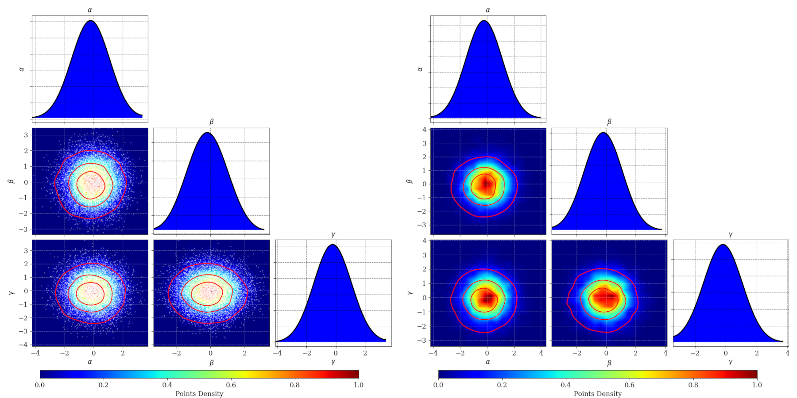

=================================
ColorCorner Software
=================================

This is a software based on corner.py (https://corner.readthedocs.io/en/latest/)
for 2d plots switched to color map [0,1] (including CL contours and scatter points) 
and 1d histograms switched to smooth density curves.

plot_scatter=True (left) , plot_scatter=False (right)

Installation
---------

.. code-block:: console
    $ pip install colorcorner

Usage [example]
---------

.. code:: python

    import numpy as np
    import matplotlib.pyplot as plt
    import colorcorner.colorcorner as cc
    
    x = np.random.normal(0,1,10000)
    y = np.random.normal(0,1,10000)
    z = np.random.normal(0,1,10000)
    
    labels = ['$\\alpha', '$\\beta$', '$\gamma$']
    
    fig = cc.plot(
                    np.transpose([x,y,z]), 
                    smooth1d=2,
                    color1d='b',
                    labels=labels,
                    cmap='jet',
                    CL=[30,60,90], # confidence levels of 30%, 60% and 90%
                    CL_color='r',  # color of the CL curves
                    plot_scatter=True,
                    scatter_color='w'
                )
    
    plt.show()

=================================  
Authors
=================================

- `Josiel Mendonça Soares de Souza <https://github.com/jmsdsouzaPhD>

=================================
License
=================================

MIT License
